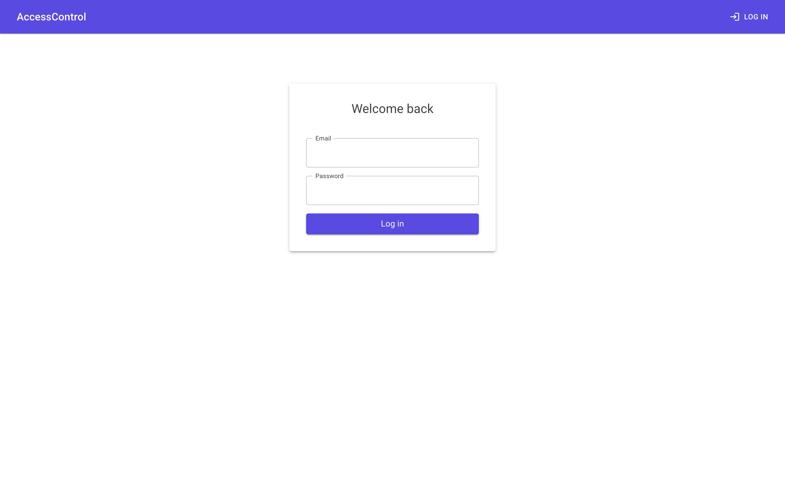
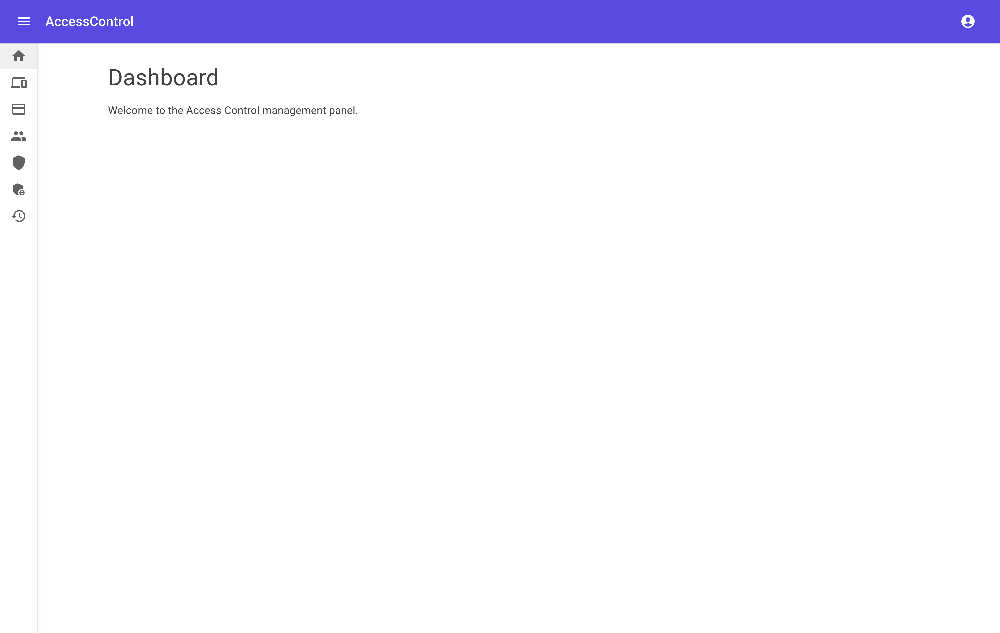
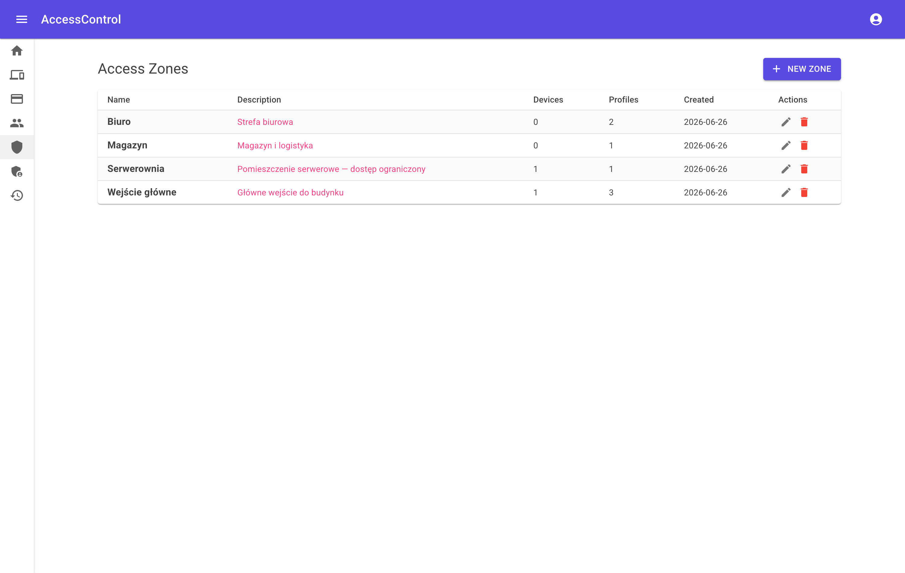
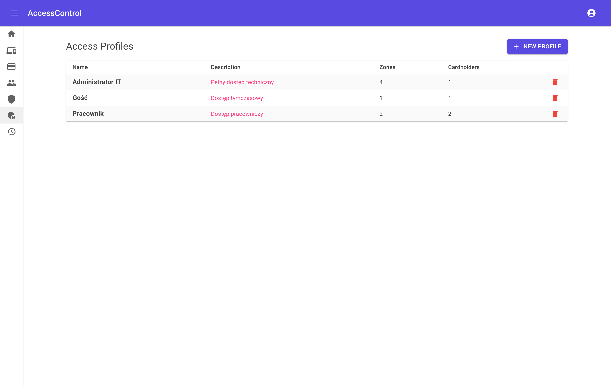
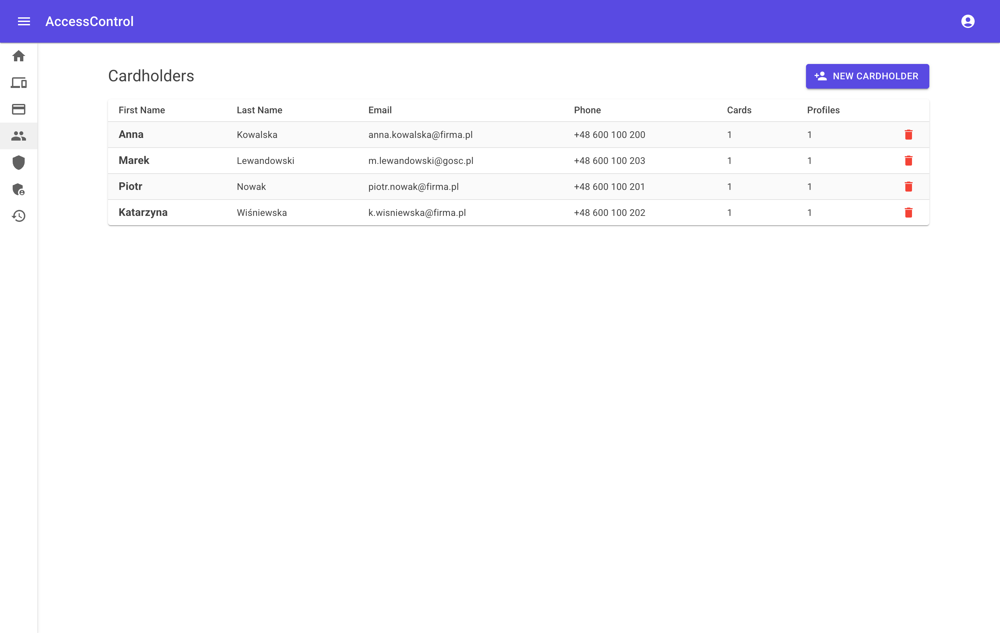
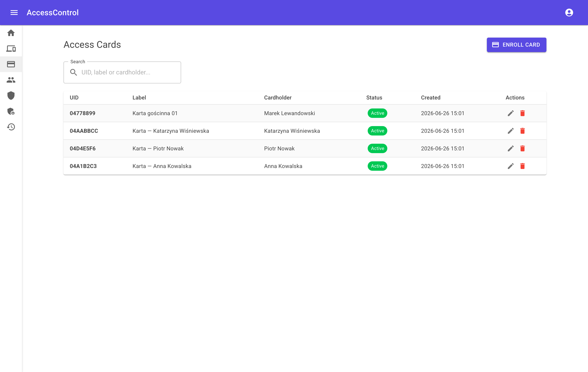
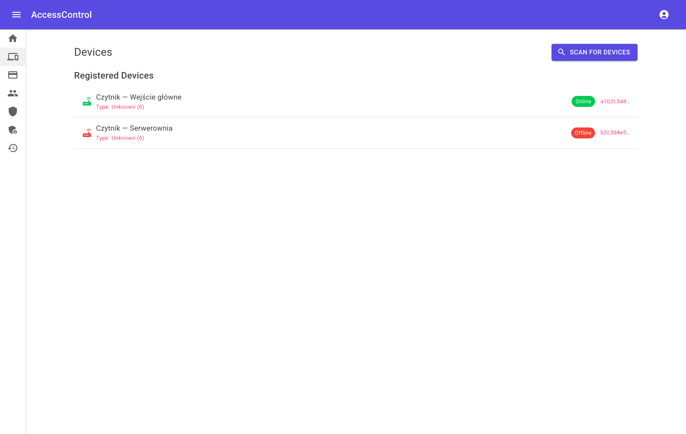
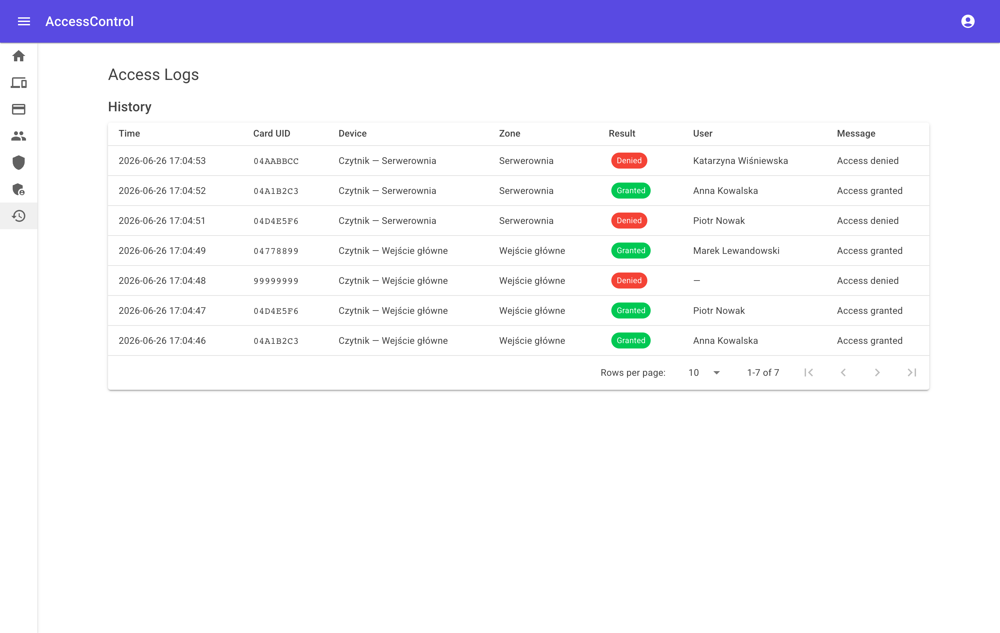

# AccessControl

An IoT access control system: contactless NFC cards are read by ESP32-based
readers, access rights are verified centrally by a .NET backend, and electric
locks are released over MQTT. The whole system is managed from a Blazor
WebAssembly admin panel.

**Stack:** .NET 10 (Clean Architecture + CQRS) · Blazor WebAssembly + MudBlazor 9 ·
PostgreSQL (EF Core) · MQTT (Mosquitto) · SignalR · mDNS · ESP32-S3 firmware
(PlatformIO) · Docker Compose.

## Features

- Contactless NFC card authorization with server-side permission checks.
- Access model: **Card → Cardholder → Access Profile → Zones**.
- Device management: mDNS auto-discovery, remote MQTT provisioning, per-device
  configuration, live online/offline status.
- Card enrollment straight from a reader (enrollment mode).
- Full audit trail of every access attempt (granted **and** denied), streamed
  live to the UI via SignalR.
- JWT authentication with the `Admin` role, forced password change on first
  login, and rate-limited auth endpoints.

## Web UI

The administration panel is a Blazor WebAssembly app (MudBlazor, Material
Design 3). Screenshots below are captured from a running instance with seeded
demo data and live access logs.

<table>
<tr>
<td width="50%"><br><sub><b>Login</b> — JWT authentication</sub></td>
<td width="50%"><br><sub><b>Dashboard</b> — management home</sub></td>
</tr>
<tr>
<td width="50%"><br><sub><b>Zones</b> — physical access areas</sub></td>
<td width="50%"><br><sub><b>Access Profiles</b> — permission sets over zones</sub></td>
</tr>
<tr>
<td width="50%"><br><sub><b>Cardholders</b> — people and their profiles</sub></td>
<td width="50%"><br><sub><b>Cards</b> — NFC cards, status and assignment</sub></td>
</tr>
<tr>
<td width="50%"><br><sub><b>Devices</b> — readers/locks with online status</sub></td>
<td width="50%"><br><sub><b>Access Logs</b> — live audit (granted / denied)</sub></td>
</tr>
</table>

> Screenshots live in [`docs/screenshots/`](docs/screenshots/) and are captured
> with Playwright driving Google Chrome against the running UI.

## Documentation

The PDFs are **build artifacts** generated from source — they are git-ignored
and produced on demand by the scripts below (output written to `docs/`).

| Generated file | Contents | Source |
|----------------|----------|--------|
| `docs/dokumentacja-projektu.pdf` | Full project documentation — technical, service and user guide (PL) | [`generate_project_docs.py`](docs/tools/generate_project_docs.py) |
| `docs/prezentacja-projektu.pdf` | Project presentation deck, includes the UI screenshots (PL) | [`generate_project_docs.py`](docs/tools/generate_project_docs.py) |
| `docs/elektronika.pdf` · `electronics.pdf` | Electronics specification — BOM, pinout, protocols, EEPROM map (PL · EN) | [`docs/elektronika.md`](docs/elektronika.md) · [`generate_pdf.py`](docs/tools/generate_pdf.py) |

Generate them with Python ([fpdf2](https://py-pdf.github.io/fpdf2/)):

```bash
pip install -r docs/tools/requirements.txt
python docs/tools/generate_pdf.py            # electronics spec (PL + EN)
python docs/tools/generate_project_docs.py   # project docs + presentation (PL)
```

## Requirements

- [.NET 10 SDK](https://dotnet.microsoft.com/download)
- [Docker & Docker Compose](https://docs.docker.com/get-docker/)

---

## Run with Docker Compose

```bash
cp .env.example .env
```

Edit `.env` and set your own values, then:

```bash
docker compose up --build
```

- **API:** http://localhost:8080
- **Health:** http://localhost:8080/health

---

## Run locally

> **Working with ESP32 firmware?** Use this mode — mDNS advertisements must
> reach your physical LAN so ESP32 devices can discover the API and MQTT broker.
> Running the API inside Docker isolates mDNS to the container network.

### 1. Start infrastructure (Mosquitto + PostgreSQL)

```bash
cp .env.example .env        # first time only — edit passwords if needed
docker compose -f docker-compose.infra.yml up -d
```

### 2. Configure secrets

```bash
cd src/AccessControl.Api

dotnet user-secrets set "Jwt:Key" "<random-string-min-32-chars>"
dotnet user-secrets set "ConnectionStrings:DefaultConnection" "Host=localhost;Port=5432;Database=access_db;Username=db_user;Password=access_pass"
dotnet user-secrets set "Admin:Email" "admin@example.com"
dotnet user-secrets set "Admin:Password" "Admin1234!"
```

### 3. Start API and UI

```bash
dotnet run --project src/AccessControl.Api
dotnet run --project src/AccessControl.UI        # separate terminal
```

- **API:** https://localhost:7157 (HTTP: http://localhost:5104)
- **UI:** https://localhost:7003
- **Scalar UI:** https://localhost:7157/scalar/v1
- **Health:** https://localhost:7157/health

Migrations and admin account seeding are applied automatically on startup.

#### Default credentials (local dev)

| Service | Key | Value |
|---------|-----|-------|
| Admin account | Email | `admin@accesscontrol.local` |
| Admin account | Password | `Admin123!` |
| PostgreSQL | User | `access_user` |
| PostgreSQL | Password | `access_pass` |
| PostgreSQL | Database | `access_db` |

The admin account is created with `MustChangePassword = true` — you will be prompted to change the password on first login.

> **Network binding:** The API listens on `0.0.0.0:5104` (all interfaces) so
> ESP32 devices on the local network can reach it. Do **not** run this on an
> untrusted or public network without a firewall.
>
> **Provisioning security:** MQTT credentials are pushed to devices over
> plain HTTP because ESP32 does not support TLS. This is acceptable on a
> trusted LAN but means credentials can be observed by anyone on the same
> network segment. Use per-device or scoped MQTT credentials in production.

### 4. Flash firmware

The card reader firmware runs on an **Arduino Nano ESP32** (ESP32-S3) and is
managed with [PlatformIO](https://platformio.org/).

#### Prerequisites

- [PlatformIO Core (CLI)](https://docs.platformio.org/en/latest/core/installation/index.html)
  (`pip install platformio`) or the
  [PlatformIO IDE extension](https://marketplace.visualstudio.com/items?itemName=platformio.platformio-ide) for VS Code.
- USB cable connected to the Nano ESP32.

#### Build

```bash
cd firmware/card-reader-standalone
pio run
```

#### Upload (flash)

```bash
cd firmware/card-reader-standalone
pio run -t upload
```

PlatformIO will auto-detect the port. If it fails, specify it explicitly:

```bash
pio run -t upload --upload-port COM9        # Windows
pio run -t upload --upload-port /dev/ttyUSB0  # Linux / macOS
```

> **Nano ESP32 DFU note:** The board uses DFU upload (not classic serial).
> If the flash completes but the device doesn't restart, press the **RESET**
> button (or double-tap it) to boot the new firmware.

#### Monitor serial output

```bash
pio device monitor --baud 115200
```

#### After flashing

The ESP32 will:
1. Connect to WiFi (captive portal on first boot — connect to `AccessControl-XXYY` AP).
2. Advertise itself via mDNS (`_accesscontrol._tcp`) with device info (hwid, model, features).
3. Start an HTTP server on port 80 and wait for MQTT config push from the backend.
4. In the UI: **Scan for Devices** → **Add** the device → backend automatically pushes MQTT credentials.
5. Device receives config, restarts, connects to MQTT, and starts scanning cards.

**Troubleshooting:**

- **Re-provision MQTT** — open device detail page in UI, click "Push MQTT Config".
  Alternatively: send `mqtt_reset` via Serial Monitor → reboot → device returns to provisioning mode.
- **Set broker manually** — send `mqtt_set <ip> [port]` via Serial Monitor.
- **Device not found in scan** — ensure the API is running on the same LAN
  as the ESP32 (not inside Docker). mDNS requires multicast networking.
- **NFC not detected** (`nfc:false` in heartbeat) — power-cycle the board;
  DFU flashing can leave the I2C bus stuck (the firmware recovers on boot).

---

## Hardware wiring — Card Reader + Lock Controller (all-in-one)

**Board:** Arduino Nano ESP32 (ESP32-S3)

### Components

| Component | Notes |
|-----------|-------|
| PN532 NFC module | I2C mode: DIP SW1=ON, SW2=OFF |
| RGB LED (common cathode) | 3× resistors required |
| Buzzer TMB12A05 | Active buzzer 5 V — requires NPN transistor driver |
| HW-482 relay module | Controls the electric lock |
| Electric lock | Connected to relay NO/COM terminals |
| Reset button (momentary) | Hold during boot for factory reset |

### Pin assignments

| Signal | Arduino pin | GPIO | Notes |
|--------|-------------|------|-------|
| PN532 SDA | A4 | GPIO11 | 4.7 kΩ pull-up to 3V3 |
| PN532 SCL | A5 | GPIO12 | 4.7 kΩ pull-up to 3V3 |
| PN532 VCC | 3V3 | — | |
| PN532 GND | GND | — | |
| LED Red anode | D2 | GPIO5 | 150 Ω in series |
| LED Green anode | D3 | GPIO6 | 100 Ω in series |
| LED Blue anode | D4 | GPIO7 | 33 Ω in series |
| LED cathode (common) | GND | — | |
| Buzzer | D5 | GPIO8 | 1 kΩ to NPN base (S8050/BC547/2N2222) |
| HW-482 IN1 | D6 | GPIO9 | Active LOW |
| HW-482 VCC | VUSB | — | 5 V |
| HW-482 GND | GND | — | |
| Factory reset button | D7 | GPIO10 | INPUT_PULLUP — other leg to GND |

### Resistor values

| Resistor | Value | Purpose |
|----------|-------|---------|
| R1 | 150 Ω | LED Red (Vf ≈ 2.0 V, I ≈ 10 mA) |
| R2 | 100 Ω | LED Green (Vf ≈ 2.1 V, I ≈ 10 mA) |
| R3 | 33 Ω | LED Blue (Vf ≈ 3.2 V, I ≈ 3 mA) |
| R4 | 4.7 kΩ | I2C SDA pull-up |
| R5 | 4.7 kΩ | I2C SCL pull-up |
| R6 | 1 kΩ | NPN transistor base (buzzer driver) |

### Buzzer driver circuit (NPN)

The TMB12A05 runs at 5 V / ~30–100 mA — beyond GPIO drive capability.
Use an NPN transistor (S8050, BC547 or 2N2222):

```
GPIO8 (D5) ── 1 kΩ ── Base
                       NPN transistor
              Emitter ── GND
              Collector ── Buzzer (−)
              Buzzer (+) ── VUSB (5 V)

Add 1N4148 diode: anode → Collector, cathode → 5 V  (flyback protection)
```

### HW-482 relay — lock wiring

```
HW-482 COM ──── (+) power supply of the lock (e.g. 12 V)
HW-482 NO  ──── (+) terminal of the electric lock
Lock (−)   ──── (−) power supply of the lock
```

Use **NO** (Normally Open) = fail-secure: lock is closed when power is off.
Use **NC** (Normally Closed) = fail-safe: lock opens when power is off (fire-safety requirement).

### Factory reset procedure

1. Press and hold the reset button (D7 ↔ GND).
2. While holding — apply power (or press the board RESET button).
3. Hold for **3 seconds** — LED blinks red during countdown.
4. On success: **3× beep + white LED flash** → device restarts.
5. Device boots into WiFi provisioning AP: `AccessControl-XXYY`.

Releasing the button before 3 s cancels the reset (normal boot).

**What is cleared:**

| Data | Cleared? |
|------|----------|
| WiFi credentials | Yes |
| MQTT broker config | Yes |
| Device configuration (timers, buzzer, LED) | Yes |
| Hardware ID (HWID) | **No** — device keeps its identity in the system |

---

